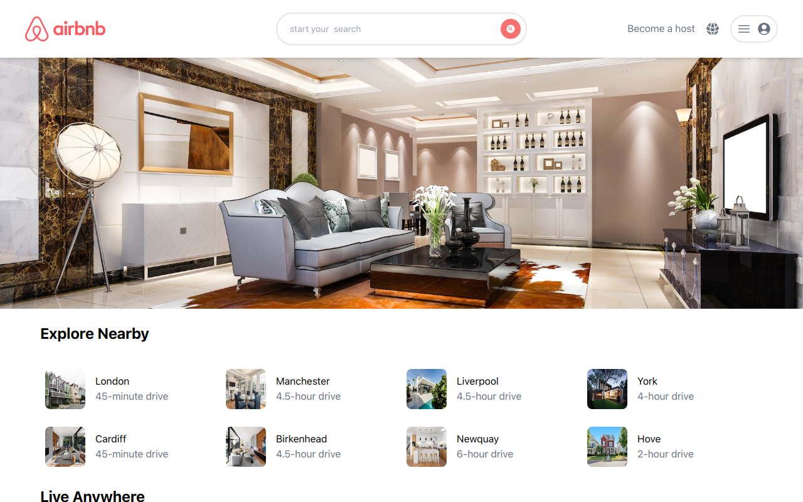

[`create-next-app`](https://github.com/vercel/next.js/tree/canary/packages/create-next-app).

##Airbnb Awesome Clone, with NextJs 

- Calendar and Map Features included
- Mock Json API data was used 

